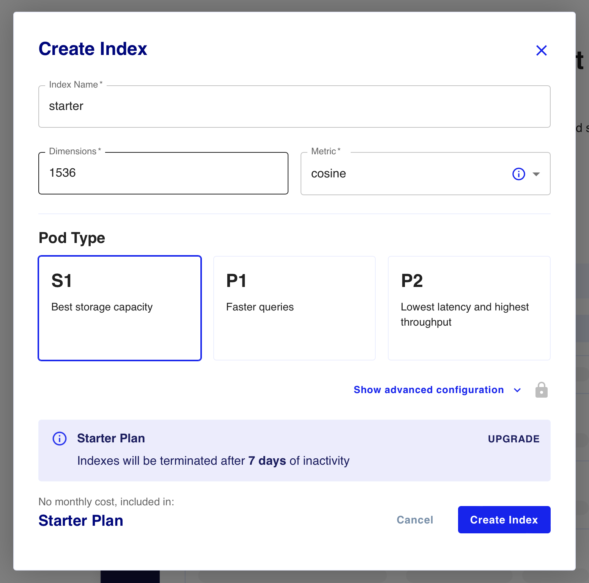

# Langchain and Pinecone starter

## Setup
* Install your venv (in VSCode->`Python: Create Environment`)
* `pip install -r requirements.txt` (installs tiktoken, dotenv-cli, langchain, pinecone-client, openai, and dependencies)
* update `.env` with your api keys

## Pinecone setup
In the Pinecone dashboard, create an index as follows (note the name for later):


## Running
* run `dotenv python app.py`
* Sample output
```bash
❯ dotenv python app.py
Could not import azure.core python package.


> Entering new RetrievalQAWithSourcesChain chain...

> Finished chain.
{'question': 'What did the president say about justice?', 'answer': 'The president mentioned justice in the context of honoring Justice Stephen Breyer and announcing the appointment of a chief prosecutor for pandemic fraud. He also mentioned the need to advance liberty and justice for LGBTQ+ Americans and to strengthen the Violence Against Women Act. \n', 'sources': 'state_of_the_union.txt'}
[tot: 2173, prmt: 2115, cmpl: 58 cost$: 0.004346]
```